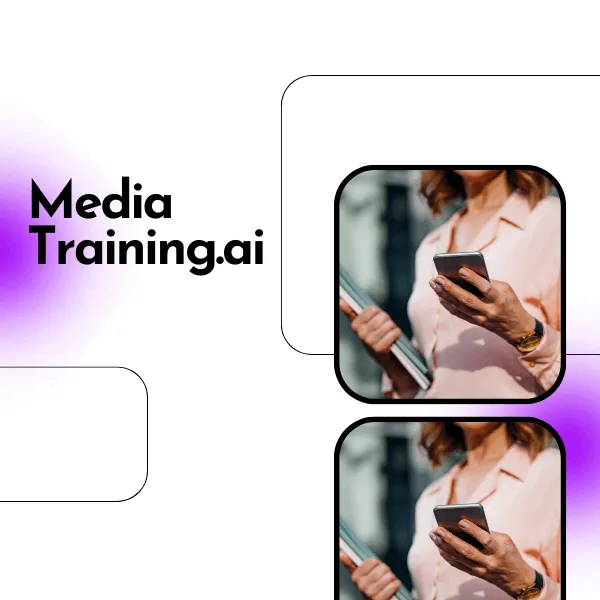

# Hi, I'm J.P. Franca

**AI Product Builder, Video & Content Creator | Cork, Ireland**

I build products with AI and know how to sell them. I shipped 3 platforms — Dine With Me, Media Training AI, and Liveloop — without a programming degree. Just AI tools, no-code platforms, and relentless problem-solving.

---

### What I Do

- **AI Product Building** — Shipped Dine With Me (iOS/Android), Media Training AI, and Liveloop using AI-assisted development
- **Communications & PR** — 8+ years: Samsung, Bayer, BH Airport, Aberje Award winner
- **Product Marketing** — Google Ads, growth strategy, go-to-market execution
- **No-Code Development** — WordPress, Vercel, Supabase, Capacitor, Xcode, Android Studio
- **Content & Storytelling** — Video production (AI-powered TikTok campaigns, 50+ corporate videos), copywriting, 2 published books, 1 film

---

### Featured Projects

<table>
  <tr>
    <td align="center" width="33%">
      
       <b><a href="https://www.liveloop.space">Liveloop</a></b>
       Social network where every post is a tiny app — play, save, remix. Next.js, React, Supabase. Launched with an AI-produced TikTok campaign.
       <a href="https://github.com/o-franca/liveloop-templates">→ templates open for contributions</a>
    </td>
    <td align="center" width="33%">
      
       <b><a href="https://www.dinewithme.org">Dine With Me</a></b>
       Social dining platform — iOS & Android, Stripe payments, real-time chat, push notifications.
    </td>
    <td align="center" width="33%">
      
       <b><a href="https://mediatraining.ai">Media Training AI</a></b>
       AI-powered public speaking coach with real-time feedback and Google Ads campaigns.
    </td>
  </tr>
</table>

| More | |
|---------|-------------|
| [Portfolio](https://www.ofmediatech.com) | 25+ real projects from corporate PR to film production |
| [A Brief Experience in Cork](https://youtube.com/watch?v=vqwLnNJWJAs) | Independent film — 30+ actors, 6 sponsors, premiere for 60 |

---

### Career Highlights

- **Aberje Award Winner** — Localiza D&I Programme (Brazil's top comms award)
- **BH Airport** — 100+ publications, 50+ videos, 30,000 passengers/day
- **MSL Group** — Samsung, ABCR, Inframerica Airports
- **Everise** — 40 US calls/day, 87-93% quality scores
- **Published Author** — 2 books on Amazon
- **Film Producer** — Short film in Cork with 1,230 website visitors

---

### Languages

English | Portuguese | Spanish

---

### Let's Connect

- **Portfolio:** [ofmediatech.com](https://www.ofmediatech.com)
- **LinkedIn:** [joaopaulofranca](https://www.linkedin.com/in/joaopaulofranca/)
- **Email:** oconnorfranca@gmail.com
- **WhatsApp:** [+353 83 080 5289](https://wa.me/353830805289)

Available as **Employee** | **VAT Registered Company** | **Remote**
